 

 

## 01 · About

Hi, I'm **Furqan**. I build high-performance, beautiful, and scalable cross-platform mobile apps with **Flutter** and **Dart**.

- Currently building **YOUR_PROJECT** <!-- replace: your best current project, with a link -->
- Learning **SOMETHING_SPECIFIC** <!-- e.g. a package, pattern, or platform you're really studying -->
- Fun fact: **YOUR_FUN_FACT**

 

## 02 · Toolbox

  

 

## 03 · Activity

 

<picture>
  <source media="(prefers-color-scheme: dark)" srcset="https://raw.githubusercontent.com/Maazitm/Maazitm/output/snake-dark.svg">
  <source media="(prefers-color-scheme: light)" srcset="https://raw.githubusercontent.com/Maazitm/Maazitm/output/snake.svg">
  
</picture>

 

<table>
  <tr>
    <td width="50%" align="center"></td>
    <td width="50%" align="center"></td>
  </tr>
</table>

 

## 04 · Featured work

 

## 05 · Let's talk

Open to Flutter projects, collaborations, and full-time roles. The fastest way to reach me is [email](mailto:siddifurqan@gmail.com) or [LinkedIn](https://www.linkedin.com/in/siddi-furqan-maz-2a57a0279/).
